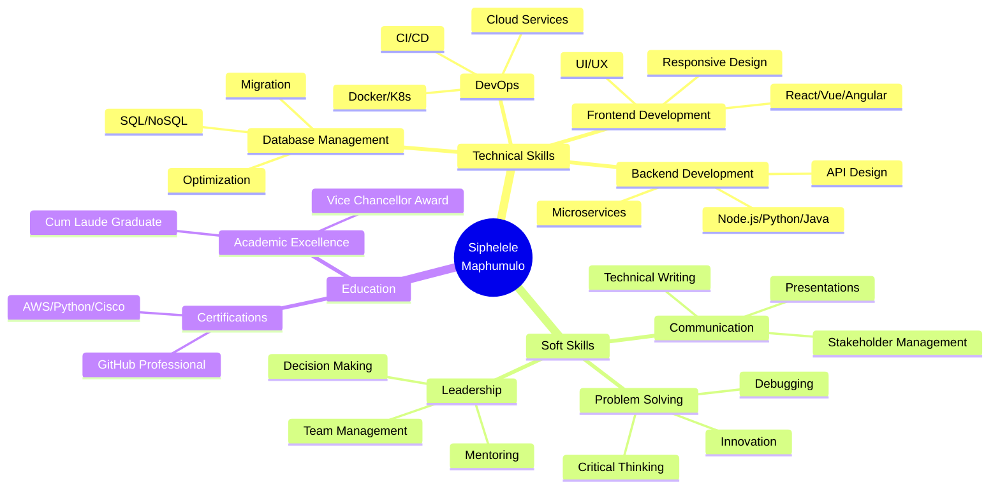

<div align="center">

<!-- Animated Header -->


<!-- Dynamic Typing Effect -->
[](https://git.io/typing-svg)

<!-- Animated GIF -->


<!-- Social Badges with Glow Effect -->
<p align="center">
  <a href="mailto:siphelelemaphumulo@gmail.com">
    
  </a>
  <a href="https://www.linkedin.com/in/siphelele-maphumulo-52a787355/">
    
  </a>
  <a href="tel:+27686764623">
    
  </a>
  <a href="https://github.com/Siphelele-Maphumulo">
    
  </a>
</p>

<!-- Profile Views Counter with Animation -->
<p align="center">
  
  
  
</p>

</div>

---

<!-- Fancy Gradient Divider -->


### 🏃‍♂️ My Progress  

<div align="center">

<!-- CodeTime Badge -->
[](https://codetime.dev)

<!-- Animated Subheader -->
[](https://git.io/typing-svg)

<!-- Hackatime Stats -->


<!-- Hackatime Badge -->
<br>


</div>

---

## 🎯 About Me: From Waiter to Award-Winning Developer


```typescript
const siphelele = {
  title: "Full-Stack Developer & Tech Educator",
  location: "📍 Durban, South Africa",
  status: "🚀 Building Tomorrow's Solutions Today",
  
  achievements: [
    "🏆 Vice Chancellor's Award Winner",
    "🥇 #1 Academic Achiever - Faculty of Natural Sciences",
    "🎓 Graduated Cum Laude",
    "⭐ 200+ Students Mentored"
  ],
  
  mindset: {
    motivation: "Transforming challenges into opportunities",
    passion: "Creating innovative solutions that matter",
    drive: "Continuous learning and excellence",
    goal: "Empowering communities through technology"
  },
  
  currentFocus: [
    "Building scalable web applications",
    "Teaching next-gen developers",
    "Contributing to open source",
    "Exploring AI & Machine Learning"
  ],
  
  funFact: "Started university while working as a waiter to fund my education 💪"
};
```

<br clear="right"/>

---

## 🛠️ Tech Arsenal: My Digital Toolbox

<div align="center">

### 🎨 **Frontend Development**
<p>
  
</p>
<p>
  
</p>

### ⚙️ **Backend & Server**
<p>
  
</p>
<p>
  
</p>

### 🗄️ **Databases & Data**
<p>
  
</p>

### ☁️ **DevOps & Cloud**
<p>
  
</p>
<p>
  
</p>

### 📱 **Mobile Development**
<p>
  
  
  
</p>

### 🎨 **Design & Creative**
<p>
  
  
  
</p>

### 🧪 **Testing & Quality**
<p>
  
  
  
</p>

### 🤖 **AI & Data Science**
<p>
  
  
  
  
</p>

### 🔧 **Other Tools & Technologies**
<p>
  
</p>

</div>

---

## 📊 GitHub Stats & Activity

<div align="center">

<!-- Activity Graph -->


<!-- Most Used Languages -->

</div>

---

## 🏆 GitHub Trophies & Achievements

<div align="center">


<!-- Achievement Badges -->
<p>
  
  
  
  
</p>

</div>

---

## 🎓 Education & Certifications

<div align="center">

### 🎯 Academic Excellence

<table>
<tr>
<td align="center" width="50%">
<br/>
<b>Mangosuthu University of Technology</b><br/>
2023 | Vice Chancellor's Award Winner 🥇
</td>
<td align="center" width="50%">
<br/>
<b>Mangosuthu University of Technology</b><br/>
2019-2022 | Graduated Cum Laude 🏅
</td>
</tr>
</table>

### 📜 Professional Certifications

<p>
  
  
  
</p>
<p>
  
  
  
</p>

</div>

---

## 🚀 Featured Projects: Building Real-World Solutions

<div align="center">

### 🌟 Online Testing Web Application
[](https://github.com/Siphelele-Maphumulo/Online-Test-Web-Application)


**🎯 Mission:** Revolutionizing education in rural schools with an offline-capable testing platform

**💡 Impact:** Empowering teachers to create, manage, and deploy tests seamlessly without internet dependency

**🛠️ Tech Stack:**
<p>
  
  
  
  
  
  
</p>

**✨ Key Features:**
- ✅ Offline test creation and management
- ✅ Automated grading system
- ✅ Student performance analytics
- ✅ Question bank management
- ✅ Export results to Excel

---

### 💼 Virtual Incubation Web Platform

<!-- Clickable Project Image -->
<a href="https://virtualincubation.infinityfreeapp.com" target="_blank" rel="noopener noreferrer">
  
</a>

---

### 🚀 Live Demo & Source Code

<p align="center">
  <a href="https://virtualincubation.infinityfreeapp.com" target="_blank" rel="noopener noreferrer">
    
  </a>
  <a href="https://github.com/Siphelele-Maphumulo/VIRTUAL-INCUBATION" target="_blank" rel="noopener noreferrer">
    
  </a>
</p>

---

**🎯 Mission:**  
Empowering entrepreneurs with a comprehensive business support ecosystem.

**💡 Impact:**  
Connected **150+ entrepreneurs** with mentors, funding opportunities, and resources.

---

### 🛠️ Tech Stack
<p>
  
  
  
  
  
</p>

---

### ✨ Key Features
- ✅ Business registration portal  
- ✅ Funding application system  
- ✅ Mentor matching algorithm  
- ✅ Resource library  
- ✅ Progress tracking dashboard  

---


### 📱 Umlazi Discount Hardware Mobile App

<!-- Clickable Project Image -->
<a href="https://online-test-web-application-7mu3.onrender.com/" target="_blank" rel="noopener noreferrer">
  
</a>

---

### 🚀 Live Demo & Source Code

<p align="center">
  <a href="https://online-test-web-application-7mu3.onrender.com/" target="_blank" rel="noopener noreferrer">
    
  </a>
  <a href="https://github.com/Siphelele-Maphumulo" target="_blank" rel="noopener noreferrer">
    
  </a>
</p>

---

**🎯 Mission:**  
Transforming local retail with a seamless mobile commerce experience.

**💡 Impact:**  
Increased customer engagement by **300%** and streamlined order processing.

---

### 🛠️ Tech Stack
<p>
  
  
  
  
  
</p>

---

### ✨ Key Features
- ✅ Real-time inventory management  
- ✅ Push notifications  
- ✅ Offline mode capabilities  
- ✅ Order tracking system  
- ✅ Customer loyalty program  

---


---

## 💼 Professional Experience

<details open>
<summary><h3>🎓 Programming Tutor | Mangosuthu University of Technology (2024)</h3></summary>


**🎯 Key Achievements:**
- 📚 Mentored **200+ students** in Java, Python, and C# fundamentals
- 🏆 Achieved **95% student satisfaction** rate
- 🎖️ Recognized as **"Tutor of the Month"** for exceptional outcomes
- 💻 Created innovative learning materials and coding challenges
- 👥 Facilitated peer programming sessions and hackathons

**📈 Impact Metrics:**
- ✅ 85% student pass rate improvement
- ✅ 50+ practical projects guided
- ✅ 30+ workshops conducted

<br clear="right"/>

</details>

<details>
<summary><h3>👨‍💻 Junior Developer | Dambuza Community Development Trust (2024)</h3></summary>


**🎯 Key Achievements:**
- 🚀 Developed **5+ mobile and web applications**
- 🔍 Improved code quality by **40%** through comprehensive reviews
- 📋 Led requirements gathering for **3 major projects**
- 🐛 Resolved **150+ bugs** and implemented automated testing
- ⚡ Optimized application performance by **60%**

**💡 Technical Contributions:**
- ✅ Implemented CI/CD pipelines
- ✅ Database optimization and scaling
- ✅ API development and integration

<br clear="right"/>

</details>

<details>
<summary><h3>💻 Software Developer Intern | OculeIT / Code SA Institute (2022-2023)</h3></summary>


**🎯 Key Achievements:**
- 🏗️ Built **10+ applications** for education and business clients
- 👨‍🏫 Trained **50+ aspiring developers** in modern practices
- 🛠️ Maintained systems with **99.9% uptime**
- 🤝 Collaborated on enterprise-level solutions
- 📚 Created comprehensive technical documentation

**🌟 Learning Highlights:**
- ✅ Agile development methodology
- ✅ Full software development lifecycle
- ✅ Client communication and management

<br clear="right"/>

</details>

---


---

## 🎯 What Makes Me Different

<table>
<tr>
<td width="33%" align="center">

### 🧠 Problem Solver


✅ Complex algorithm design<br/>
✅ Performance optimization<br/>
✅ Scalable architecture<br/>
✅ Technical troubleshooting<br/>
✅ Creative solution design

</td>
<td width="33%" align="center">

### 🤝 Team Leader


✅ Agile methodology expert<br/>
✅ Cross-functional collaboration<br/>
✅ Mentoring & training<br/>
✅ Project management<br/>
✅ Conflict resolution

</td>
<td width="33%" align="center">

### 🚀 Innovation Driver


✅ Cutting-edge tech adoption<br/>
✅ User experience focus<br/>
✅ Continuous learning<br/>
✅ Open source contributor<br/>
✅ Community engagement

</td>
</tr>
</table>

---

## 🌟 Core Competencies

<div align="center">



</div>

---

## 📚 Latest Blog Posts & Articles

<div align="center">

<!-- Blog Post Cards -->
<a href="#">
  
</a>
<a href="#">
  
</a>
<a href="#">
  
</a>

</div>

---

## 🎨 Hobbies & Interests

<div align="center">

<table>
<tr>
<td align="center" width="25%">
<br/>
<b>💻 Coding</b><br/>
Building side projects<br/>and exploring new tech
</td>
<td align="center" width="25%">
<br/>
<b>📖 Reading</b><br/>
Tech blogs, books,<br/>and documentation
</td>
<td align="center" width="25%">
<br/>
<b>🎮 Gaming</b><br/>
Strategy games<br/>and problem-solving
</td>
<td align="center" width="25%">
<br/>
<b>🎵 Music</b><br/>
Coding playlists<br/>and production
</td>
</tr>
</table>

</div>

---

## 💬 Random Dev Quote

<div align="center">


</div>

---

## 📫 Let's Connect & Collaborate!

<div align="center">

 <br/>

### 🚀 Ready to Build Something Amazing?

I'm passionate about creating **innovative solutions** that drive **real business value**. Whether you need a full-stack developer, technical consultant, or problem-solving expert, I'm ready to exceed your expectations!

<br/>

<!-- Contact Buttons -->
<p>
  <a href="mailto:siphelelemaphumulo@gmail.com">
    
  </a>
  <a href="https://www.linkedin.com/in/siphelele-maphumulo-52a787355/">
    
  </a>
  <a href="tel:+27686764623">
    
  </a>
</p>

<br/>

**📍 Location:** Durban, South Africa<br/>
**📞 Phone:** +27 68 676 4623<br/>
**⏰ Timezone:** GMT+2 (SAST)

<br/>

### 💝 Support My Work

If you find my projects helpful or inspiring, please consider:

<p>
  <a href="https://github.com/Siphelele-Maphumulo">
    
  </a>
  <a href="https://github.com/Siphelele-Maphumulo?tab=followers">
    
  </a>
</p>

</div>

---

<div align="center">

### 💭 Words to Code By


<br/><br/>


**Built with 💙 by Siphelele Maphumulo** | **© 2024**

<sub>⚡ Powered by passion, fueled by coffee, driven by innovation ⚡</sub>

</div>
